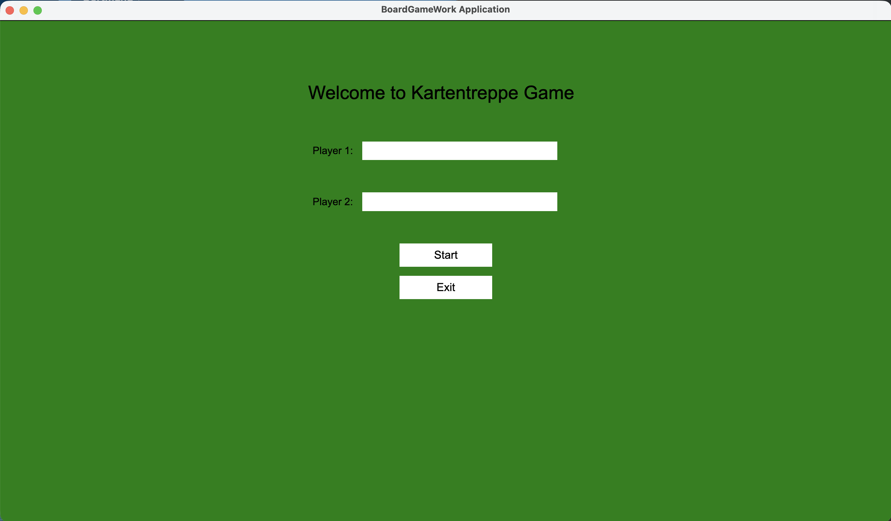
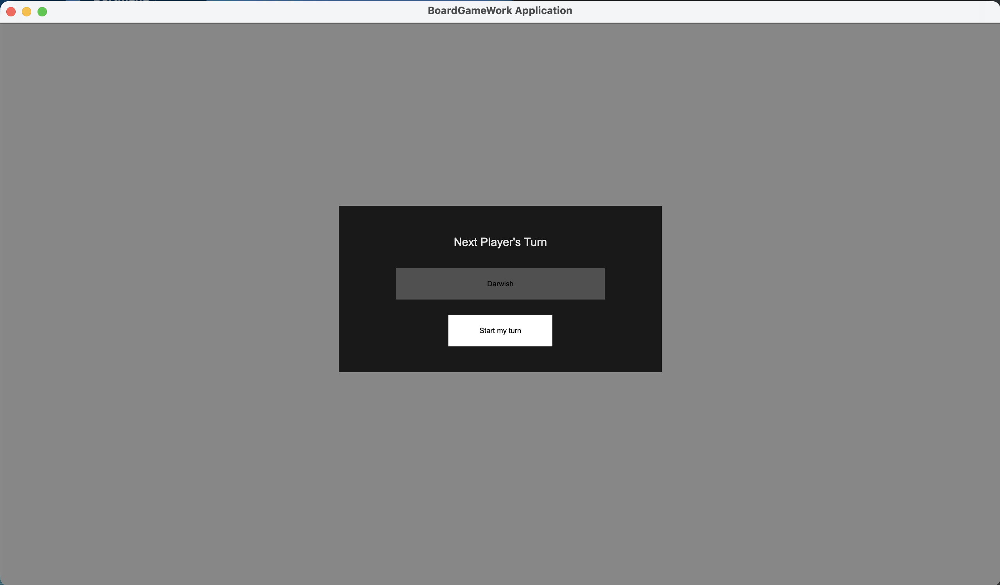
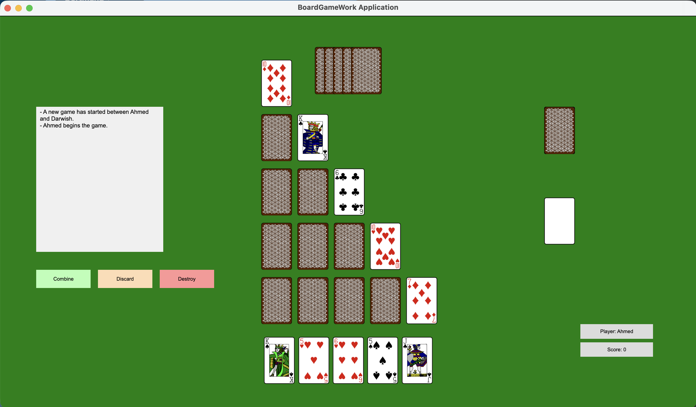
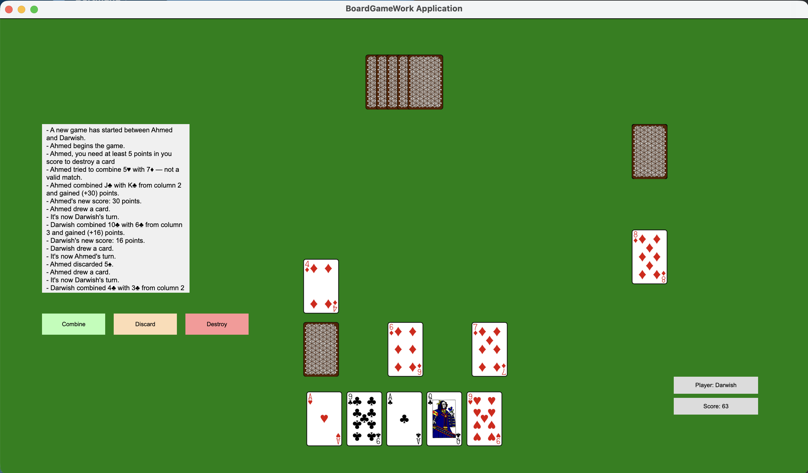
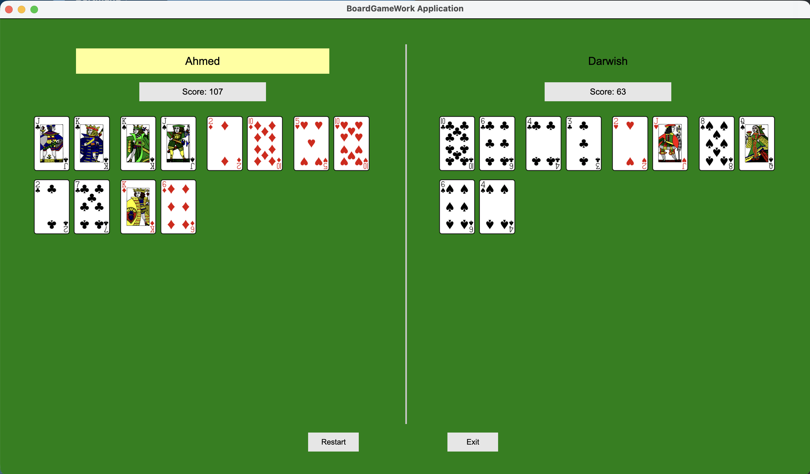

# Stairway Card Game 🎴

A two-player strategic card game developed in Kotlin, where players compete by combining cards from their hands with a central staircase of cards.

---

## 🧠 Game Concept

The game is called **"Stairway Card Game"** because a *staircase of cards* is placed in the center between two players.

Players take turns interacting with this staircase until the game ends.

---

## 👥 Players

- 2 players
- Played on the same screen
- Each player has:
    - 5 cards in hand
    - A score that increases during the game

---

## 🃏 Game Rules

### 🔄 Turn Actions

On each turn, a player can:

### 1. 🧩 Combine Cards
A player can combine:
- One card from their hand
- One card from the staircase

**Valid combinations:**
- Same **symbol** (♥ ♦ ♣ ♠)
- Same **number** (regardless of symbol)

**Result:**
- The values of both cards are added
- The total is added to the player's score

---

### 2. 💥 Destroy a Staircase Card
- Removes a card from the staircase
- Costs **5 points**
- Can only be used **once per round**
- Player can still combine after destroying

---

### 3. 🔄 Discard a Card
- Discard one card from hand
- Draw a new card
- ❗ Ends the player's turn immediately

---

## ♻️ Card Flow

- Used cards go to the **discard pile**
- After each turn:
    - Player draws a card (to always have 5 cards)
- When the **draw pile is empty**:
    - The discard pile is shuffled and reused as draw pile

---

## 🏁 Game End Conditions

The game ends when **one of the following happens**:

1. The **staircase is empty**
2. The **draw pile has been refilled once**, and after that:
    - The staircase did not change

---

## 🏆 Result Screen

At the end of the game:

- The winner is **highlighted in yellow**
- All combined cards are displayed
- Options available:
    - 🔄 Restart Game
    - 🚪 Exit

---

## 🛠️ Tech Stack

- Kotlin
- Object-Oriented Programming (OOP)
- Scene-based UI architecture

---

## 📸 Screenshots

### 🎮 Game Scenes

#### 🟢 Welcome Screen

#### 🎯 Start Turn Scene

#### 🎴 Game Scene

#### 🎴 Game Scene 2

---

### 🧾 Results

#### 🏆 Result Screen

---
## Run the Game

This project includes private university build dependencies, so building from source may require additional access.

To play the game, please use the packaged distribution available in the Releases section.

### Steps
1. Download the latest release
2. Extract the archive
3. Run the provided executable jar

---

## Note for Developers

The source code is included for demonstration and review purposes.
Because the project was developed in a university environment, some build dependencies may not be publicly accessible.
For this reason, the recommended way to run the game is through the packaged release.

---

## 💡 Features

- Turn-based gameplay
- Strategic decision-making
- Score tracking system
- Card lifecycle management (draw, discard, reuse)
- Clear UI with multiple scenes

---

## 📚 Documentation

Detailed system design and diagrams are available in the GitHub Wiki:

- Use Case Diagrams
- Sequence Diagrams
- Class Diagrams

👉 Please check the Wiki for a deeper understanding of the project architecture:
[Project Wiki](../../wiki)

---

## 🚀 Future Improvements

- Add AI opponent
- Add multiplayer (online)
- Improve animations and UI
- Add sound effects

---

## 👨‍💻 Author

Ahmed Darwish